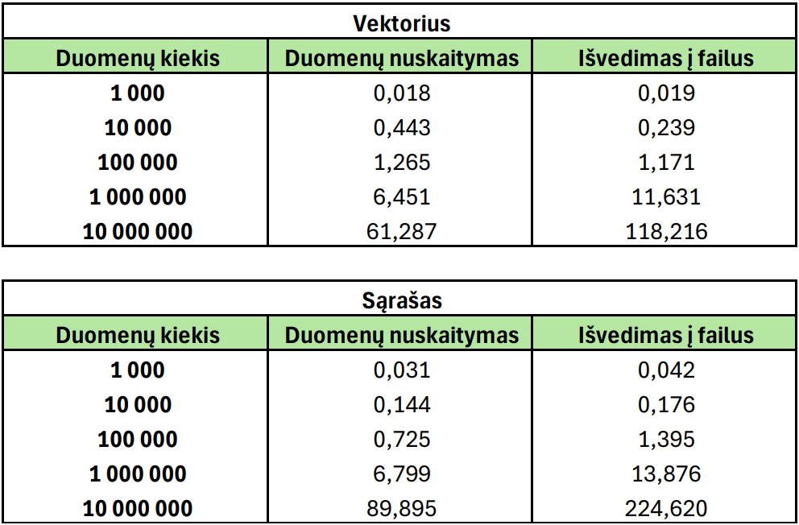
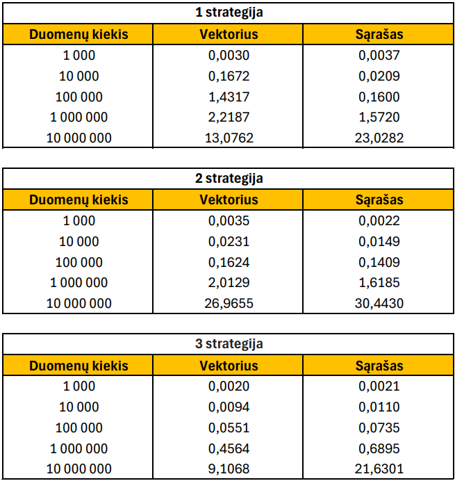
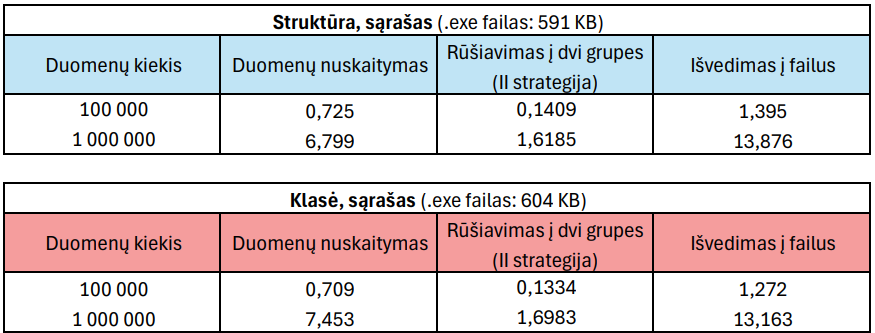
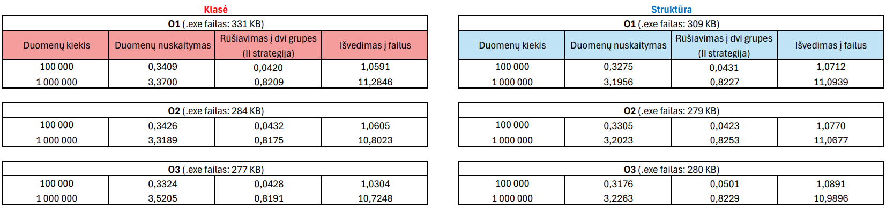

# OOP3
## Programos diegimo ir paleidimo instrukcija
### **Naudojant diegimo failą- setup.exe**
Norint įdiegti ir paleisti programą naudojant setup.exe sekite šiuos žingsnius:
- Atsisiųskite naujausią v3.0 versiją, nueidami į "Releases", pasirinkite v3.0 versiją ir paspauskite ant **Source code (zip)**;
- Išskleiskite atsisiųstą failą;
- Dukart spustelijus paleiskite setup.exe failą;
- Pasirodžius langui, prašančiam administratoriaus teisių, paspauskite "YES", tada spustelėkite „Next“ (Kitas), kad tęstumėte diegimą;
- Kai diegimas bus baigtas, paspauskite „Finish“ (Baigti), kad uždarytumėte diegimo vedlį;
- Paleiskite programą iš pradžios meniu arba spustelėkite ant darbalaukyje atsiradusios piktogramos.

Norint pašalinti programą sekite šiuos žingsnius:
- Susiraskite programą program files aplankale ("C:/Program files (x86)/VU/Rugilė-Černiauskaite");
- Dukart spustelėkite ant **unins000.exe** failo, sekite vediklio nurodymus.

### **Naudojant cmake**
Norint įdiegti ir paleisti programą naudojant cmake sekite šiuos žingsnius:
- Atsisiųskite [v1.0](https://github.com/rugcer04/OOP2) versiją eidami į "Releases", pasirinkite v1.0 versiją ir paspauskite ant **Source code (zip)**;
- Išskleiskite atsisiųstą failą "OOP-v1.0.zip";
- Įsidiekite "cmake-3.31.0-rc-windows-x86_64" bei "msys2-x86_64-20240113"
- Dukart spustelėkite ant failo "run.bat" ir šiek tiek palaukite;
- Sekite ekrane pateiktas instrukcijas arba vadovaukitės žemiau pateikta programos naudojimosi instrukcija (rekomeduojama pradžioje susigeneruoti studentų failus);
- Jeigu visus žingsnius atlikote teisingai, tai tame pačiame aplankale turite rasti naują aplankalą pavadinimu "Release", užėje į aplankalą, matysite aplikaciją pavadinimu "Studentai.exe", kuria paspaudus du kartus galėsite pratęsti darbą su programa.

## Programos naudojimosi instrukcija
- Paleidus programą turite pasirinkti kokį konteinerį norite naudoti darbui su studentų duomenimis (spauskite 'V' dirbti su vektoriumu, 'L' - su sąrašu).

- Po to turėsite pasirinkti ką toliau norite daryti: 'I' - įvesti studentų duomenis ranka, 'F' - nuskaityti duomenis iš failo, 'G' - generuoti failus su studentų duomenimis ar 'D' - demonstruoti metodus:

- Pasirinkus įvesti duomenis ranka ('I'), turėsite įvesti kiek norite įtraukti studentų.
    - Kiekvienam studentui reikia įvesti jo vardą, pavardę ir pasirinkti ar norite įvesti jo namų darbų ir egzamino pažymius ranka ('R') ar generuoti atsitiktinai ('A'). Jeigu pasirinkote įvesti pažymius ranka, turėsite suvesti pažymius po vieną, kaskart paspaudžiaunt 'enter' klavišą. Kai baigsite namų darbų įvedimą, spauskite dukart 'enter' klavišą. Tada įveskite egzamino rezultatą.

    - Jeigu pasirinkote sugeneruoti automatiškai, turite įrašyti kiek namų darbų pažymių sugeneruoti, sugeneruoti pažymiai bus išspausdinami.

    - Tada turėsite pasirinkti kokiu būdu apskaičiuoti galutinį rezultatą: ar naudojant vidurkį ('V'), ar medianą ('M').  

    - Po to turėsite pasirinkti kokia tvarka noretumėte pateikti studentus: surūšiuotus pagal vardą ('V'), pagal pavardę ('P'), pagal galutinį rezultatą mažėjimo tvarka ('M') ar didėjimo tvarka ('D').

    - Tada turėsite pasirinkti kur išvesti rezultatus: ekrane ('E') ar faile ('F'). Jeigu pasirinksite failą - turėsite įvesti failo pavadinimą (su .txt), kuriame norite išsaugoti rezultatus. Programa baigia darbą- rezultatus matysite ekrane arba faile - priklausomai nuo jūsų pasirinkimo.

- Pasirinkus nuskaityti duomenis iš failo ('F'), turėsite įrašyti failo pavadinimą, kurį norite nuskaityti.

    - Tada turėsite pasirinkti kokiu būdu apskaičiuoti galutinį rezultatą: ar naudojant vidurkį ('V'), ar medianą ('M'). 

    - Po to turėsite pasirinkti kokia tvarka noretumėte pateikti studentus: surūšiuotus pagal vardą ('V'), pagal pavardę ('P'), pagal galutinį rezultatą mažėjimo tvarka ('M') ar didėjimo tvarka ('D').

    - Tada turėsite pasirinkti pagal kokią strategija norite suskirstyti studentus į dvi grupes: '1', '2' ar '3' (strategijos aprašytos žemiau). Suskirstyti studentai bus automatiškai įrašyti į "vargsiukai.txt" ir "kietiakai.txt" failus. Po kiekvienos operacijos (failo nuskaitymo, surūšiavimo į grupes ir išvedimo į failus) bus išspausdinami operacijų vykdymo laikai. Programa baigia darbą.

- Pasirinkus generuoti duomenis ('G') bus automatiškai sugeneruoti 5 failai su studentų duomenimis (po 1000, 10000, 100000, 1000000, 10000000 įrašų). Kiekvienas studentas turės po 15 namų darbų pažymių ir egzamino pažymį. Po kiekvieno sugeneruoto failo bus išspausdinta generavimo laikas. Programa baigia darbą.

- Pasirinkus demonstruoti metodus ('D') bus paprašoma įvesti vieno studento duomenis, taip pat studento duomenys bus nuskaitomi iš eilutės, kad pademonstruoti įvesties ir išvesties operatorius. Taip pat bus pademonstruota implementuota trijų metodų taisyklė aprašyta žemiau.

## Versijų aprašymas
- **v0.1 pradinėje** versijoje sukuriama `Studentas` struktūra studento duomenims saugoti. Vartotojui leidžiama pasirinkti galutinio balo skaičiavimo būdą. Aprašomos dvi funkcijos galutiniam balui apskaičiuoti- naudojant vidurkį arba medianą. Sukuriamos funkcijos įvesti studento vardą, pavardę ir namų darbų ir egzamino pažymius, leidžiama vartotojui pasirinkti įvesti pažymius patiems arba juos generuoti atsitiktinai. Pasirinkimai ir įvesti duomenys yra išvedami lentele.

- **v0.1** versijoje pradinė versija papildoma nuskaitymu iš failo galimybe. Vartotojas pasirenka ar nori įvesti duomenis ranka, ar nuskaityti iš failo, taip pat - ar išvestį matyti ekrane ar sukurti ir įrašyti į naują failą. Projektas apiforminamas, surūšiuojami studentai, panaudojamas išimčių valdymas.

- **v0.2** versijoje programa papildoma failų generavimu ir nuskaitytų failų suskirstymu į dvi grupes pagal galutinį pažymį. Šios grupės įrašomos į atskirus failus, surūšiuotus pagal naudotojo parinktą parametrą. Atlikta programos veikimo greičio analizė.

- **v0.3** versijoje pridedama galimybė pasirinkti dirbti su vektoriais arba su sąrašais.

- **v1.0** versijoje studentų rūšiavimo į dvi grupes strategija papildoma dar dvejomis strategijomis:
    - `1 strategija`: bendras studentų konteineris skaidomas į du naujus to paties tipo konteinerius: "vargšiukai" ir "kietiakai";
    - `2 strategija`: iš bendro studentų konteinerio "vargšiukus" perkeliame į "vargšiukų" konteinerį ir ištriname iš studentų konteinerio, jame lieka tik "kietiakai";
    - `3 strategija`: atsižvelgiant į rušiavimo greičius, trečia strategija veikia 2 strategijos principu, tačiau darbas paspartintas pirma studentus surūšiuojant su stable_partition funckija.

- **v1.1** versijoje sukurta ir realizuota studento klasė, programa pritaikyta dirbti su šia klase.

- **v1.2** versijoje realizuota trijų metodų taisyklė bei įvesties i išvesties operatoriai.

- **v1.5** versijoje sukuriama bazinė žmogaus klasė, užtikrinama, jog ji būtų abstrakti, studento klasė padaroma išvestine iš žmogaus klasės.

- **v2.0** versijoje sukuriama Doxygen dokumentacija (html ir LaTeX), realizuojami unit testai naudojant google tests framework (https://github.com/google/googletest). Testuojamas galutinio įvertinimo apskaičiavimas pagal vidurkį, kopijavimo konstruktorius, konstruktorius su pažymio generavimu, išvesties operatorius.
  
- **v3.0** sukurtas programos diegimo failas - setup.exe.

## Studento klasė
Studentento klasė yra išvestinė klasė iš Žmogaus bazinės klasės. Žmogaus klasė yra abstrakti, negalima sukurti jos objektų.

#### Trijų metodų taisyklė
- `Kopijavimo konstruktorius` - naudojamas sukuriant naują objekto kopiją iš esamo objekto;
- `Kopijavimo priskyrimo operatorius` - naudojamas, kai jau egzistuojančiam objektui priskiriami kito objekto duomenys;
- `Destruktorius` - atlaisvina atmintį kai objektas yra sunaikinamas, yra automatiškai kviečiamas, kai objektas išeina iš apimties (scope) arba sunaikinamas.

#### Įvesties operatorius
Perdengtas operatorius suteikia galimybę vartotojui įvesti studento duomenis iš terminalo: vartotojas turi įvesti studento vardą, pavardę, pagal pasirinkimą pažymius įvesti ranka arba generuoti atsitiktinai; arba iš teksto srauto.

#### Išvesties operatorius
Perdengtas operatorius išveda studento objekto duomenis (vardą, pavardę, galutinį pažymį) terminale arba į failą.

## Programos veikimo greičio analizė
Programos testavimas su studentų sąrašų failais, sudarytais iš `1000`, `10000`, `100000`, `1000000`, `10000000` įrašų buvo pakartotas 3 kartus, atskirai dirbant su vektoriais ir sąrašais. Pateikiami šių testų laikų vidurkiai.

### Failų kūrimas
| Kiekis | Laikas |
|:-------|-------:|
| `1 000` | 0,009s |
| `10 000` | 0,045s |
| `100 000` | 0,390s |
| `1 000 000` | 3,943s |
| `10 000 000` | 34,656s |

### Duomenų nuskaitymo ir išvedimo į failus testavimas

#### Analizė
Kai duomenų kiekis mažesnis, programos greitis naudojant vektorius ir sąrašus mažai skiriasi. Tačiau dirbant su 10 000 000 įrašų skirtumas tampa akivaizdesnis – su vektoriais programa veikia žymiai greičiau.

### Studentų rūšiavimo į dvi grupes strategijų testavimas

#### Analizė
- `1 strategija`: su mažesniu kiekiu duomenų su sąrašu programa veikia sparčiau, tačiau su 10 mln. - priešingai;
- `2 strategija`: taip pat kaip ir pirmoje startegijoje, su mažesniais failais programa veikia sparčiau su sąrašu, su didžiausiu failu - su vektoriumi;
- `3 strategija`: lyginant su 1 ir 2 strategijomis, darbas su abejais konteineriais vyksta sparčiausiai. Visais atevejais programa veikia greičiau su vektoriumi;

## Struct ir class spartos testavimas
Palyginama programos sparta naudojant struct ir class tipo studentus. Testavimui parinktas vienas konteineris- sąrašas (list) bei 2 studentų rūšiavimo į dvi grupes strategija. Testavimas atliktas su 100 000 ir 1 000 000 įrašų failais.

#### Analizė
Matome, jog programos veikimo laikas naudojant struct ir class tipo studentus yra labai panašus. Duomenų nuskaitymas ir rūšiavimas į dvi grupes su didesniu failu vyksta truputį greičiau su struktūra, tačiau išvedimas į failus- su klase.

## Kompiliatoriaus optimizavimas
Atlikita eksperimentinė analizė priklausomai nuo kompiliatoriaus optimizavimo lygio, nurodyto per flag'us: O1, O2, O3.

#### Analizė
Programos sparta pritaikius skirtingus flag'us stipriai nesiskiria, tačiau išvedimas į failus vyksta sparčiausiai su O3 flag'u, kitų procesų sparta priklauso nuo failų dydžių ir ar programoje naudojama struct, ar class. Mažiausi .exe failai yra panaudojant O3 flag'ą

## Testavimo sistemos parametrai
- CPU: Intel(R) Core(TM) i5-8265U CPU @ 1.60GHz, 1800 Mhz, 4 Core(s), 8 Logical Processor(s)
- RAM: 8.00 GB
- HDD: WDC WD10SPZX-21Z10T0
- SSD: NVMe KINGSTON RBUSNS8154P3128GJ1
